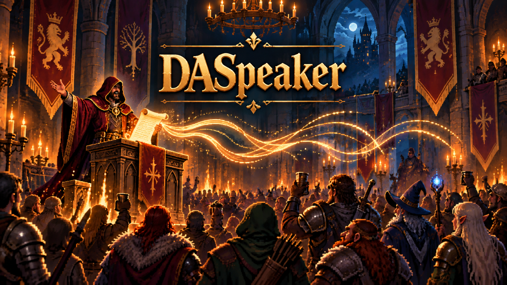
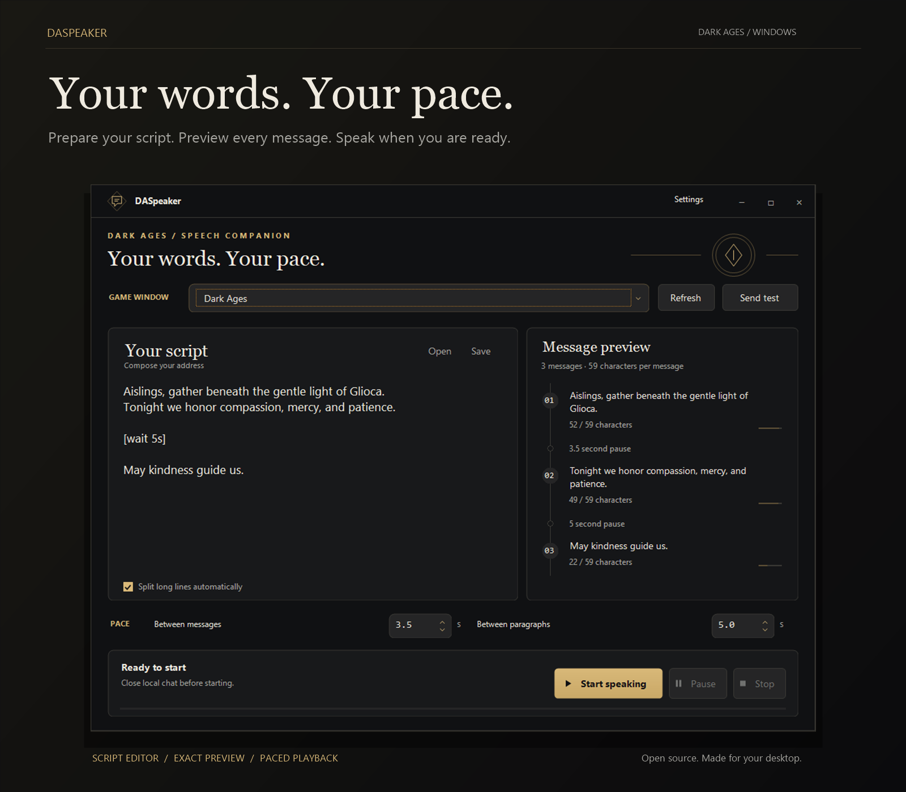
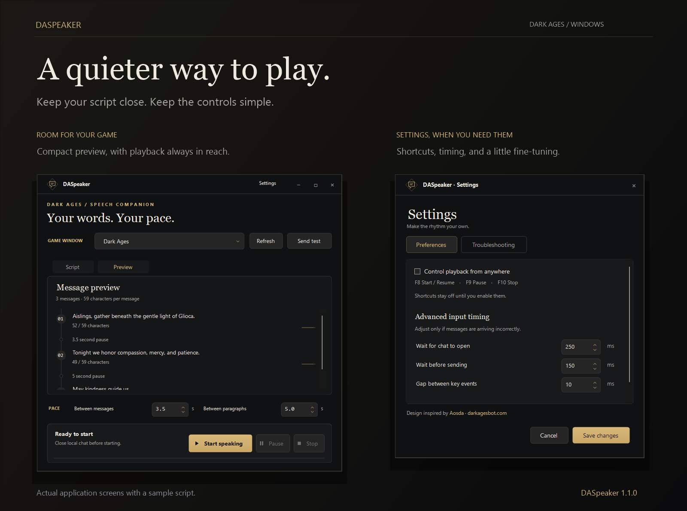

<div align="center">

# DASpeaker

**Your words, at your pace.**

Prepare speeches and announcements for Dark Ages, then send them to chat at your own pace.

[](https://github.com/BuildWithRaymond/DASpeaker/actions/workflows/build.yml)
[](https://github.com/BuildWithRaymond/DASpeaker/releases/latest)
[](LICENSE)

[**Download for Windows**](https://github.com/BuildWithRaymond/DASpeaker/releases/latest) · [Quick start](#quick-start) · [User guide](docs/usage.md) · [Contributing](CONTRIBUTING.md)

</div>

<p align="center">
  
</p>



[View full-size workspace screenshot](docs/images/screenshots/ceremonial-main.png)

## A little room for your words

Prepare a ceremony, announcement, or longer speech without typing every line in
game. DASpeaker turns your script into chat-sized messages, shows the exact
sequence, and lets you decide when to speak, pause, or start again.

- **Write naturally.** Paste a script or open a text file. Long lines split at whole words.
- **See what comes next.** Preview every message, character count, and pause before starting.
- **Find your rhythm.** Set message and paragraph delays, or add a pause within the script.
- **Stay in control.** Pause and resume from the same place. Optional F8 / F9 / F10 shortcuts work while you play.
- **Keep your place.** Your draft and preferences are remembered between sessions.
- **Keep it compact.** Smaller windows switch between Script and Preview; advanced options live in Settings.



Full-size screenshots: [Compact preview](docs/images/screenshots/ceremonial-compact.png) · [Settings](docs/images/screenshots/ceremonial-settings.png)

## Quick start

### Requirements

- Windows x64
- [.NET 10 Desktop Runtime x64](https://dotnet.microsoft.com/en-us/download/dotnet/10.0)
- The official USDA Dark Ages 7.41 client

### Install and speak

1. Download the Windows ZIP from [Releases](https://github.com/BuildWithRaymond/DASpeaker/releases/latest) and extract it.
2. Open **DASpeaker.exe** and accept the administrator prompt.
3. Open Dark Ages, then select its window in DASpeaker. Close local chat.
4. Choose **Send test** and check for `GLIOCA TEST` in game.
5. Paste your script, review **Message preview**, and choose **Start speaking**.

**Pause** finishes the current message and holds your place. **Resume** continues.
**Stop** finishes the current message and resets the script to the beginning.

## A script can be this simple

```text
Aislings, gather beneath the gentle light of Glioca.
Tonight we honor compassion, mercy, and patience.

[wait 5s]

May kindness guide us.
```

Messages have a **59-character limit**. Automatic splitting keeps words intact.
Blank lines separate paragraphs, and `[wait 5s]` adds an explicit pause.
Scripts use printable ASCII text. Start with the [example script](examples/ceremony.txt).

See the [user guide](docs/usage.md) for timing, shortcuts, script rules, and recovery.
The preview shows what DASpeaker will send; the game does not provide delivery
receipts, so check the result in game.

## Build it yourself

On Windows with the .NET 10 SDK:

```powershell
git clone https://github.com/BuildWithRaymond/DASpeaker.git
cd DASpeaker
dotnet restore DASpeaker.slnx
dotnet build DASpeaker.slnx -c Release --no-restore
dotnet test DASpeaker.slnx -c Release --no-build
```

See [development](docs/development.md) for publishing and project structure.
Bug reports and focused pull requests are welcome; read [CONTRIBUTING.md](CONTRIBUTING.md).

## With thanks

Special thanks to **[ewrogers](https://github.com/ewrogers)** for their work on
**[SleepHunter](https://github.com/ewrogers/SleepHunter4)**. We studied its Windows
input handling while building DASpeaker, and appreciate the work shared with
the Dark Ages community.

Design inspired by **[Aosda](https://darkagesbot.com)**.

More in [Credits](CREDITS.md) and [Third-party notices](THIRD_PARTY_NOTICES.md).

## License

[MIT](LICENSE). Free to use, modify, and share under the license terms.
